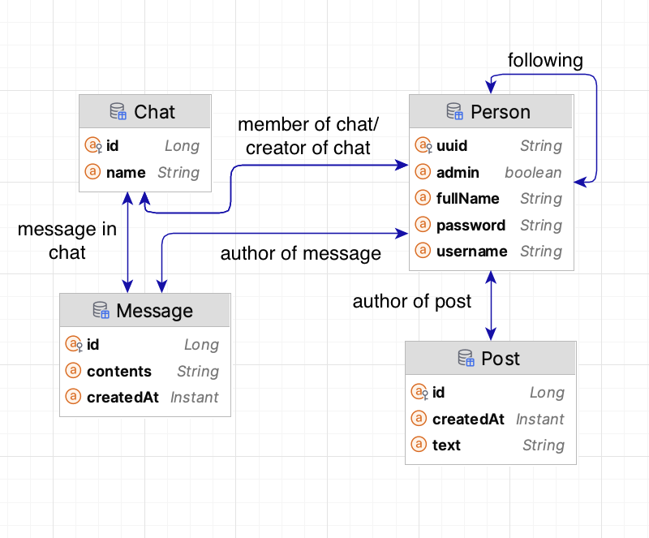

# Y

Due to X's popularity rapidly falling after the rebranding, the upper management had decided that only complete rewrite could help, and to be budget-efficient had decided to outsource it to junior student developers in the Czech Republic...

## Functionality

As it was evident with Twitter's 280 character limit, "less is more" is in our DNA, and if we extend it to the features that need to be in the next generation of social networking it is obvious - the less features the better!

As such, our new platform only supports these operations:

* Creating an account, editing and deleting it
* Posting posts, deleting and editing them
* Creating chats with other users, editing them and deleting them
* In these chats, creating editing and deleting messages also.
* Following other users and seeing all posts of who you're following in a chronological order

Also, to prevent misuse of our platform, it is required to implement some admin tools, but, thankfully, our corporate overlord has suggested that for now a simple one: a big red button that deletes all users who have some text (e.g. "Elon is bad") in the messages or posts they posted is enough, available to all admins through the web interface (tab "Haters"), the user created without any other admins is set to be an admin (e.g. the first user), who can also then admin and unadmin users (if they want to, even themselves).

## Boring implementation details

### How to start it

It should be enough to just run `docker compose -f docker-compose.example.yml up` in the root, and the app should be soon available at [http://localhost:8080](http://localhost:8080)

Also, the api documentation is available at [http://localhost:8080/swagger-ui/index.html](http://localhost:8080/swagger-ui/index.html), to use it first get the access token via login (`/token`) then make swagger use it with the "Authorize" button in the header

Also, here's the entity relationship diagram:
